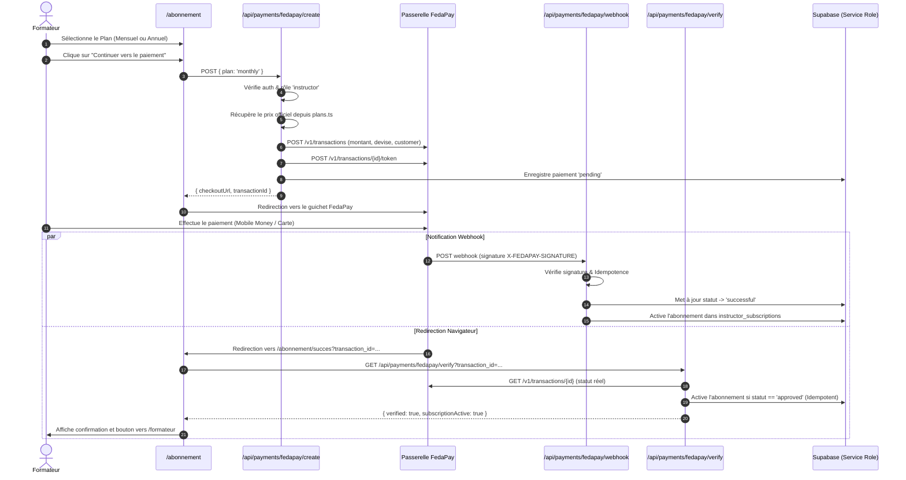

# SKILLUP — PLAN D'IMPLÉMENTATION : PHASE 9C
## INTÉGRATION DU PAIEMENT FEDAPAY POUR L'ABONNEMENT FORMATEUR

---

## 1. OBJECTIF ET RÈGLES MÉTIER ABSOLUES

La **Phase 9C** connecte le système d'abonnement formateur existant à la passerelle de paiement sécurisée **FedaPay**.

### Règles fondamentales :
1. **ÉLÈVE** : Ne paie **aucun abonnement** SkillUp. L'accès à `/abonnement` et aux routes API de paiement lui est strictement interdit.
2. **FORMATEUR** :
   - Création de compte gratuite.
   - Configuration gratuite.
   - Préparation des formations gratuite.
   - **Abonnement actif obligatoire pour pouvoir publier.**
3. **SÉPARATION STRICTE** : L'abonnement SkillUp du formateur est totalement indépendant et séparé des futurs paiements des élèves aux formateurs.
4. **VÉRIFICATION SERVEUR STRICTE** : Le simple affichage de `/abonnement/succes` ou un paramètre URL ne confère **aucun droit**. Seule la confirmation officielle transmise par l'API FedaPay ou par son webhook active l'abonnement côté serveur.

---

## 2. ARCHITECTURE FEDAPAY & SÉCURITÉ

### 2.1 Environnements
- **Sandbox** : `https://sandbox-api.fedapay.com/v1` (pour tests sécurisés sans impact financier)
- **Live / Production** : `https://api.fedapay.com/v1`
- Variable : `FEDAPAY_ENVIRONMENT=sandbox` ou `FEDAPAY_ENVIRONMENT=live`

### 2.2 Sécurité des clés
- Les clés secrètes (`FEDAPAY_SECRET_KEY`, `FEDAPAY_WEBHOOK_SECRET`, `SUPABASE_SERVICE_ROLE_KEY`) sont réservées **strictement au serveur**.
- Aucune clé secrète n'est exposée au navigateur, aux composants React, aux variables `NEXT_PUBLIC_*` ou aux cookies.

---

## 3. PLANS & TARIFS OFFICIELS (`src/lib/subscriptions/plans.ts`)

Tous les prix sont centralisés dans une configuration serveur unique. Aucun tarif n'est codé en dur dans les composants d'interface.

| Plan | Durée | Montant (XOF) | Économie | Caractéristiques principales |
| :--- | :--- | :--- | :--- | :--- |
| **Mensuel (`monthly`)** | 30 jours | **9 900 FCFA** | Sans engagement | Publications illimitées, gestion modules/leçons, quiz, statistiques. |
| **Annuel (`yearly`)** | 365 jours | **99 000 FCFA** | **2 mois offerts** | Tous les avantages mensuels, tranquillité 12 mois, accès prioritaire. |

---

## 4. MODÈLE DE DONNÉES & BASE DE DONNÉES SUPABASE

### Table `public.subscription_payments` (`supabase/migrations/05_subscription_payments.sql`)
- `id` : UUID Primary Key
- `instructor_id` : UUID References `auth.users(id)`
- `subscription_id` : UUID References `public.instructor_subscriptions(id)`
- `plan` : `monthly` | `yearly`
- `amount` : Entier (FCFA)
- `currency` : `XOF`
- `provider` : `fedapay`
- `provider_transaction_id` : Identifiant unique FedaPay (clé d'idempotence)
- `status` : `pending` | `successful` | `failed` | `canceled`
- `raw_response` : JSONB
- `created_at` / `updated_at` : Timestamps UTC

### Sécurité RLS
- `SELECT` : Le formateur consulte uniquement ses propres paiements (`instructor_id = auth.uid() AND is_instructor()`).
- `INSERT/UPDATE` : Réservé au `service_role` serveur.

---

## 5. FLUX DE PAIEMENT COMPLET

---

## 6. GESTION DE L'IDEMPOTENCE

- Deux webhooks identiques ou la combinaison Webhook + Vérification en direct ne provoquent **aucun double débit**, ni **aucun doublon d'abonnement**.
- La clé de déduplication est `provider_transaction_id`.
- Dès qu'un paiement est marqué `successful`, toute requête ultérieure avec la même transaction est reconnue et acquittée sans opération supplémentaire.

---

## 7. LIMITES STRICTES DE LA PHASE 9C

Les fonctionnalités suivantes sont **strictement hors périmètre** et ne sont pas implémentées :
- Dashboard complet formateur avec KPIs avancés (Phase 9D).
- Système de création complète de cours (modules, chapitres, upload vidéo).
- Stockage vidéo (Supabase Storage / Mux / Cloudflare Stream).
- Paiement des formations à l'unité par les élèves.
- Liens de paiement personnalisés des formateurs.
- Système de certificats.

---

## 8. PRÉPARATION DE LA PHASE 9D

La Phase 9D se concentrera sur l'espace formateur opérationnel :
- Dashboard formateur avec vue de son abonnement actif.
- Interface de préparation des cours et leçons.
- Déblocage du bouton de publication sous condition stricte d'abonnement actif (`canPublishCourse`).
